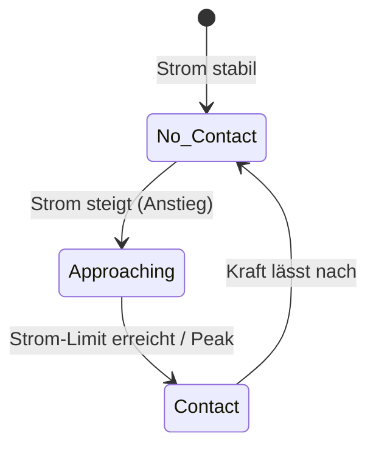
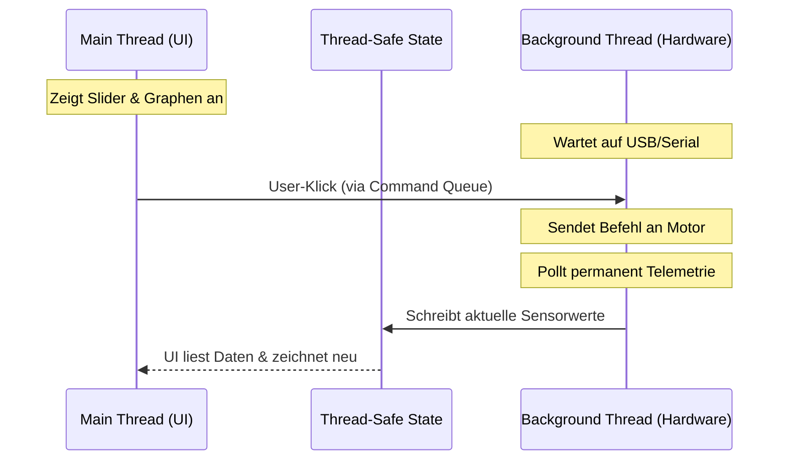

# 🤖 RobotHand – Dynamixel XL330-M288 Hand-Controller

[](https://www.python.org/)
[](https://docs.python.org/3/library/tkinter.html)
[](https://emanual.robotis.com/docs/en/software/dynamixel/dynamixel_sdk/overview/)

*(For English speakers: Please see [CONTRIBUTING.md](CONTRIBUTING.md) or run the UI to see the integrated English interface.)*

**RobotHand** ist ein Tool zur Steuerung einer elastischen, kraftgesteuerten Roboterhand über **Dynamixel XL330-M288** Servomotoren. Die Software wurde primär für das Projekt „Soft!-robotic Hands" (SoSe 2026) entwickelt, um Forschern und Studenten die Evaluierung von nachgiebigen Greifern zu erleichtern.


---

## 🚀 Quick Start

Damit du innerhalb von 2 Minuten starten kannst:

```bash
# 1. Abhängigkeiten installieren
pip install dynamixel-sdk pillow

# 2. Applikation starten
python main.py
```

Dann in der GUI: **"Connect"** klicken.

### 📏 Detaillierte Kalibrierungs-Anleitung
Damit die Software weiß, wo "offen" und wo "geschlossen" ist, müssen die Encoder-Werte angelernt werden:
1. Bringe einen Finger (z.B. per Hand im abgeschalteten Torque-Modus oder über den endlosen Wheel-Modus) in die **maximal geöffnete** Position.
2. Klicke bei diesem Motor in der GUI auf **"Set Zero"**.
3. Bringe denselben Finger in die **geschlossene Greifposition**.
4. Klicke auf **"Set Limit"**.
5. Klicke oben rechts auf das **Disketten-Symbol**, um die Kalibrierung in die `calibration.json` zu speichern.

Der Positionsregler dieses Motors skaliert ab sofort exakt und linear von 0 % bis 100 %.

---

## 📋 Inhaltsverzeichnis

- [🚀 Quick Start](#-quick-start)
- [🎯 Projektkontext & Nutzen](#-projektkontext--nutzen)
- [✨ Hauptmerkmale](#-hauptmerkmale)
- [🏗️ Architektur & Code-Erklärung](#️-architektur--code-erklärung)
- [⚙️ Konfiguration & Technische Limits](#️-konfiguration--technische-limits)
- [🛠️ Troubleshooting](#️-troubleshooting)
- [⚠️ Bekannte Limitierungen](#️-bekannte-limitierungen)
- [📂 Projektstruktur](#-projektstruktur)
- [📦 Installation & Setup (Detailliert)](#-installation--setup-detailliert)
- [📜 Lizenz & Abhängigkeiten](#-lizenz--abhängigkeiten)

---

## 🎯 Projektkontext & Nutzen (Warum RobotHand?)

Die Steuerung wurde speziell konzipiert für:
* **Forschung & Lehre:** Studenten und Forscher, die im Bereich Soft-Robotics arbeiten (z.B. SoSe 2026 Robotik-Projekte).
* **Passive Nachgiebigkeit:** Die Hand nutzt den *Current-Based Position Mode* der Servos. Das bedeutet, dass sie sich bei mechanischem Widerstand verformt, anstatt starr zu blockieren.
* **Real-World Use Case:** Greifen empfindlicher Objekte (wie z. B. reifes Obst oder zerbrechliche Bauteile), ohne diese durch übermäßige Kraftausübung zu beschädigen.

---

## ✨ Hauptmerkmale

### 1. Betriebsmodi
* **Positionsmodus (Joint Mode):** Ermöglicht die gradgenaue Winkelregelung der Servos.
* **Geschwindigkeitsmodus (Wheel Mode):** Erlaubt endlose Drehungen mit kontinuierlicher Geschwindigkeitsregelung (geeignet für Spindeln oder Seilwickler).
* **Strombasierter Positionsmodus (Current-Based Position Mode):** Kombiniert Positionsregelung mit einer aktiven Strombegrenzung für ein nachgiebiges Greifverhalten.

### 2. Telemetrie & Hardwareschutz
* **Echtzeit-Stromüberwachung:** Grafischer Plot der Motorströme.
* **Temperaturüberwachung:** Visuelle Warnung bei Überhitzung (> 55 °C).
* **Not-Aus (Emergency Stop):** Sofortiges Deaktivieren des Drehmoments aller Motoren.

### 3. State-Machine der Kontakterkennung
Das System nutzt Flankenerkennung und Signalglättung, um festzustellen, ob ein Finger Widerstand spürt.



---

## 🏗️ Architektur & Code-Erklärung

Um Latenzen in der GUI zu vermeiden, ist die App nach dem MVC-Muster (Model-View-Controller) aufgebaut und stark multithreaded.

### 1. Threading-Workflow



**Start-Sequenz in `main.py`:**
```python
# Model (Thread-Safe Data)
self.state = RobotState(config.motor_ids)

# Background-Worker (Hardware)
self.hardware = HardwareManager(self.state)
self.hardware.start()

# Main-Thread (GUI)
self.ui = RobotHandUI(self.root, self)
```

### 2. Queue & Status-Synchronisation
Damit die Threads sich nicht blockieren, kommunizieren sie nur über Queues (`self.cmd_queue`) und thread-sichere Variablen in `models.py`. Die GUI liest Daten nur aus dem RAM (`self.state`), während der Hardware-Thread diese RAM-Werte kontinuierlich aktualisiert.

---

## ⚙️ Konfiguration & Technische Limits

### Die `config.json`
Zentrale Parameter werden hierüber gesteuert:
```json
{
  "hardware": {
    "port": "COM10",           // Unter Linux meist /dev/ttyUSB0
    "baudrate": 115200,        // Standard Dynamixel Baudrate
    "timeout_ms": 1000
  },
  "motors": {
    "ids": [0, 1, 2, 3, 4],    // Adressierte Servo-IDs
    "protocol": "2.0"
  }
}
```

### Leistungswerte & Limits
* **Max. Polling-Frequenz:** ca. 50 Hz für die Telemetrie-Abfrage.
* **Latenz:** ~20 ms pro Lesezyklus aller Motoren über den Bus.

---

## 🛠️ Troubleshooting

Häufige Probleme und deren schnelle Lösung:

* **"Connection fails / Port error"**:
  * Überprüfe, ob der COM-Port in der `config.json` stimmt (Windows: Gerätemanager prüfen, Linux: `ls /dev/ttyUSB*`).
  * Stelle sicher, dass kein anderes Programm (z.B. Dynamixel Wizard) den Port belegt.
* **"Motor bewegt sich nicht"**:
  * Überprüfe in der UI, ob **Torque** aktiviert ist.
  * Prüfe, ob die Motor-LED rot blinkt (Hardware-Error wie Overload).
* **"UI friert ein oder stockt"**:
  * Stelle sicher, dass die `baudrate` in der config mit der im Motor-EEPROM hinterlegten Baudrate übereinstimmt (meist 115200 oder 57600).

---

## ⚠️ Bekannte Limitierungen

* **Single-Threaded Hardware Queue:** Es werden aktuell keine parallelen Servo-Befehle unterstützt, sie werden seriell über den Bus abgearbeitet.
* **Kalibrierungsverlust:** Nach einem Power-Cycle (Strom aus) muss neu kalibriert werden. Eine Persistenz im EEPROM ist derzeit nicht aktiv.
* **Real-Time Garantien:** Da Python und Tkinter nicht echtzeitfähig sind, gibt es keine harten Timing-Garantien für exakte Mikrosekunden-Latenzen.

---

## 📂 Projektstruktur

* **`main.py`**: Controller (initialisiert UI und Hardware-Threads)
* **`ui.py`**: Tkinter-GUI und Event-Handling
* **`hardware.py`**: HardwareManager (serielle Kommunikation, Polling)
* **`models.py`**: Thread-sichere Datenmodelle (`RobotState`, `MotorState`)
* **`calibration.py`**: Encoder-Ticks ↔ Prozentwerte
* **`sequences.py`**: Sequenzer für zeitgesteuerte Bewegungsabläufe
* **`test_app.py`**: Unit-Tests

**Konfigurationsdateien:**
* `config.json` – Hardware (Port, Baudrate, Motor-IDs)
* `calibration.json` – Kalibrierte Endanschläge
* `motor_names.json` – GUI-Bezeichner
* `poses.json` – Gespeicherte Handpositionen
* `sequences.json` – Bewegungsabläufe

---

## 📦 Installation & Setup (Detailliert)

1. Python 3 herunterladen und installieren.
2. Hardware anschließen (siehe Verkabelung):
```text
PC (USB) <--> Robotis U2D2 <--> TTL-Bus <--> Motor #0 ... Motor #4
```
3. Führe das `test_app.py` Skript aus, um sicherzustellen, dass die Abhängigkeiten sauber laufen:
```bash
python -m unittest test_app.py
```

---

## 📜 Lizenz & Abhängigkeiten

Dieses Projekt basiert auf folgenden Open-Source-Komponenten:
* **[Dynamixel SDK](https://emanual.robotis.com/docs/en/software/dynamixel/dynamixel_sdk/overview/)** (Steuerungsprotokoll)
* **[XL330-M288 E-Manual](https://emanual.robotis.com/docs/en/dxl/x/xl330-m288/)** (Spezifikationen der Hardware)

*Erstellt für Forschungs- und Bildungszwecke.*
