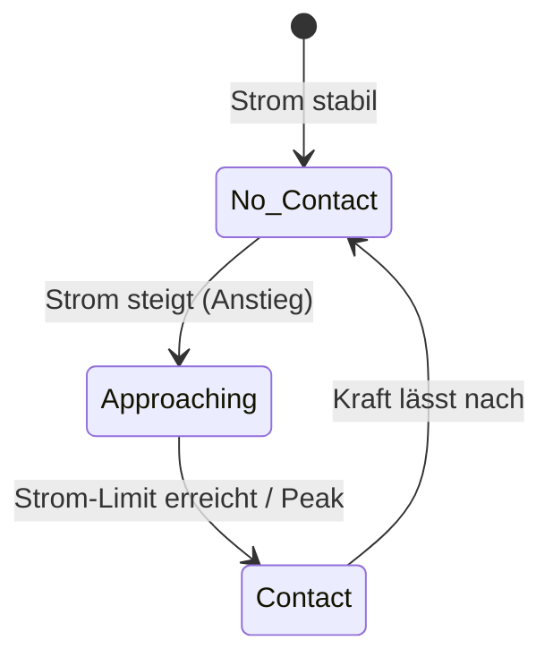
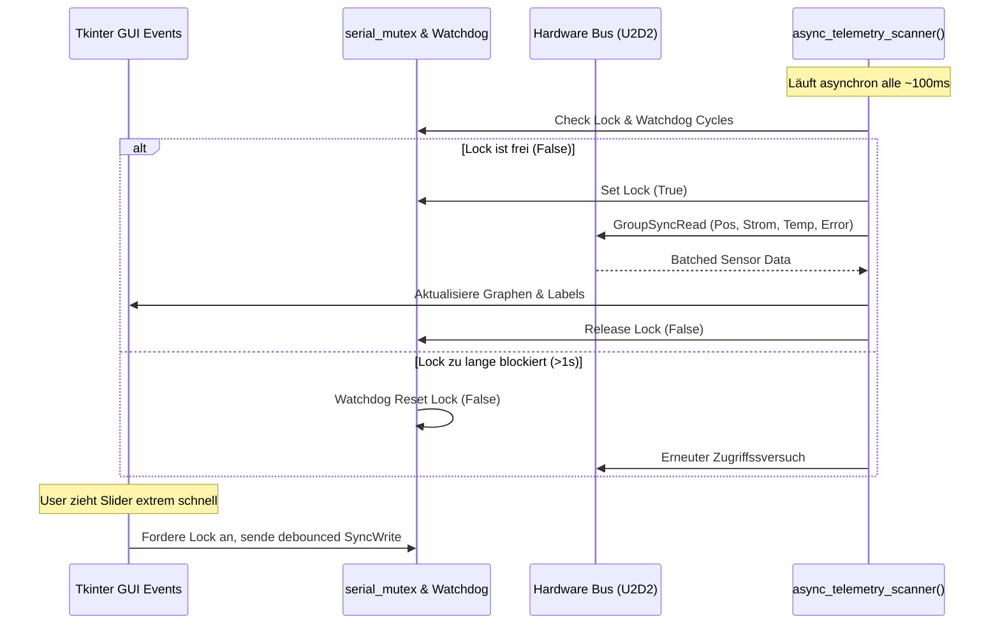

# 🤖 RobotHand – Dynamixel XL330-M288 Hand-Controller

[](https://www.python.org/)
[](https://docs.python.org/3/library/tkinter.html)
[](https://emanual.robotis.com/docs/en/software/dynamixel/dynamixel_sdk/overview/)

*(For English speakers: Please see [CONTRIBUTING.md](CONTRIBUTING.md) or run the UI to see the integrated English interface.)*

**RobotHand** ist ein Tool zur Steuerung einer elastischen, kraftgesteuerten Roboterhand über **Dynamixel XL330-M288** Servomotoren. Die Software wurde primär für das Projekt „Soft!-robotic Hands" (SoSe 2026) entwickelt, um Forschern und Studenten die Evaluierung von nachgiebigen Greifern zu erleichtern.


---

## 🚀 Quick Start

Damit du innerhalb von 2 Minuten starten kannst:

```bash
# 1. Virtuelles Environment erstellen & aktivieren
python -m venv .venv
# Windows: .venv\Scripts\activate
# Linux/Mac: source .venv/bin/activate

# 2. Abhängigkeiten installieren
pip install -r requirements.txt

# 3. Applikation starten
python motor_control.py
```

Dann in der GUI: **"Connect"** klicken.

### 📏 Detaillierte Kalibrierungs-Anleitung
Damit die Software weiß, wo "offen" und wo "geschlossen" ist, müssen die Encoder-Werte angelernt werden:
1. Bringe einen Finger (z.B. per Hand im abgeschalteten Torque-Modus oder über den endlosen Wheel-Modus) in die **maximal geöffnete** Position.
2. Klicke bei diesem Motor in der GUI auf **"Set Zero"**.
3. Bringe denselben Finger in die **geschlossene Greifposition**.
4. Klicke auf **"Set Limit"**.
5. Klicke oben rechts auf das **Disketten-Symbol**, um die Kalibrierung in die `calibration.json` zu speichern.

**Intelligente Rekalibrierung:** Wenn du später einen Endpunkt nachjustierst, berechnet die Software automatisch die Verschiebung (Shift) und wendet diese sofort auf den gegenüberliegenden Punkt sowie auf alle deine gespeicherten Posen (`poses.json`) und Sequenzen (`sequences.json`) an!

Der Positionsregler dieses Motors skaliert ab sofort exakt und linear von 0 % bis 100 %.

---

## 📋 Inhaltsverzeichnis

- [🚀 Quick Start](#-quick-start)
- [🎯 Projektkontext & Nutzen](#-projektkontext--nutzen)
- [✨ Hauptmerkmale](#-hauptmerkmale)
- [🏗️ Architektur & Code-Erklärung](#️-architektur--code-erklärung)
- [⚙️ Konfiguration & Technische Limits](#️-konfiguration--technische-limits)
- [🛠️ Troubleshooting](#️-troubleshooting)
- [⚠️ Bekannte Limitierungen](#️-bekannte-limitierungen)
- [📂 Projektstruktur](#-projektstruktur)
- [📦 Installation & Setup (Detailliert)](#-installation--setup-detailliert)
- [📜 Lizenz & Abhängigkeiten](#-lizenz--abhängigkeiten)

---

## 🎯 Projektkontext & Nutzen (Warum RobotHand?)

Die Steuerung wurde speziell konzipiert für:
* **Forschung & Lehre:** Studenten und Forscher, die im Bereich Soft-Robotics arbeiten (z.B. SoSe 2026 Robotik-Projekte).
* **Passive Nachgiebigkeit:** Die Hand nutzt den *Current-Based Position Mode* der Servos. Das bedeutet, dass sie sich bei mechanischem Widerstand verformt, anstatt starr zu blockieren.
* **Real-World Use Case:** Greifen empfindlicher Objekte (wie z. B. reifes Obst oder zerbrechliche Bauteile), ohne diese durch übermäßige Kraftausübung zu beschädigen.

---

## ✨ Hauptmerkmale

### 1. Betriebsmodi & Greifsteuerung
* **Positionsmodus (Joint Mode):** Ermöglicht die gradgenaue Winkelregelung der Servos.
* **Geschwindigkeitsmodus (Wheel Mode):** Erlaubt endlose Drehungen mit kontinuierlicher Geschwindigkeitsregelung (geeignet für Spindeln oder Seilwickler).
* **Strombasierter Positionsmodus (Current-Based Position Mode):** Kombiniert Positionsregelung mit einer aktiven Strombegrenzung für ein nachgiebiges Greifverhalten (Standard-Limit: 600 mA zum Schutz der Hardware).
* **Soft-Grip / Soft-Close Modus:** Automatische Kontakt- und Greiferkennung. Sobald ein Finger Widerstand spürt, friert die Position automatisch ein, um das Objekt sanft zu halten.
* **Posen & Live-Strombegrenzung:** Beim manuellen Anfahren gespeicherter Posen ("▶ Go") werden stets die aktuellen GUI-Sliderwerte für das Stromlimit verwendet, um unbeabsichtigte Kraftbegrenzungen durch alte Posen-Werte zu vermeiden.

### 2. Telemetrie, Analyse & Hardwareschutz
* **Echtzeit-Stromüberwachung & Export:** Performanter grafischer Plot der Motorströme. Daten können direkt als Excel-Tabelle (`.xls`), CSV (`.csv`) oder PNG-Grafik exportiert werden.
* **Temperatur- & Fehlerüberwachung:** Visuelle Warnung bei Überhitzung (> 55 °C) und Hardware-Fehlern inklusive Ein-Klick-Motor-Reboot-Funktion.
* **Not-Aus (Emergency Stop):** Sofortiges Deaktivieren des Drehmoments aller Motoren über GUI oder Tastenkürzel (`Esc`).
* **Flood-Protection & Mutex-Watchdog:** Automatische Rate-Limiter und ein selbstheilender Mutex-Watchdog (setzt blockierte Locks nach ~1s automatisch zurück) verhindern Hänger und Überlastung der Hardware.

### 3. Anpassbarkeit & Ergonomie
* **Individuelle Motorbezeichnung:** Doppelklick auf einen Motornamen in der GUI erlaubt die freie Benennung der Finger (z.B. "Daumen", "Zeigefinger").
* **Erweiterte Sequenzsteuerung:** Umfangreicher Schritt-Editor mit individueller Geschwindigkeits- und Kraftregelung pro Schritt sowie duplizierbaren/verschiebbaren Abläufen.
* **Dark / Light Mode & Layout-Speicherung:** Umschaltbares Design mit automatischer Wiederherstellung der Fenstergeometrie.

### 4. State-Machine der Kontakterkennung
Das System nutzt Flankenerkennung und Signalglättung, um festzustellen, ob ein Finger Widerstand spürt.



---

## 🏗️ Architektur & Code-Erklärung

Die Applikation ist als monolithisches Skript (`motor_control.py`) aufgebaut. Um Latenzen in der GUI zu vermeiden und Serial-Port-Kollisionen zu verhindern, nutzt das Programm einen asynchronen Polling-Loop in Kombination mit einem Mutex (Lock) und einem Watchdog.

### 1. Asynchroner Polling-Workflow & Watchdog



### 2. Batch Motor Commands (SyncRead & SyncWrite)
Anstatt 5 Motoren sequentiell abzufragen (was zu extremen Latenzen führt), verwendet die Applikation das Protocol 2.0 `GroupSyncRead` und `GroupSyncWrite`. 
Position, Strom, Temperatur und Hardware-Fehler von allen 5 Motoren werden in nur 4 Transaktionen pro Zyklus ausgelesen. Dies ermöglicht eine extrem stabile und performante Telemetrie.

---

## ⚙️ Konfiguration & Technische Limits

### Die `config.json`
Zentrale Parameter werden hierüber gesteuert (falls vorhanden, ansonsten direkt im Codekopf definiert):
```json
{
  "hardware": {
    "port": "COM10",           // Unter Linux meist /dev/ttyUSB0
    "baudrate": 115200,        // Standard Dynamixel Baudrate
    "timeout_ms": 1000
  },
  "motors": {
    "ids": [0, 1, 2, 3, 4],    // Adressierte Servo-IDs
    "protocol": "2.0"
  }
}
```

### Leistungswerte & Limits
* **Max. Polling-Frequenz:** > 50 Hz für die Telemetrie-Abfrage dank `SyncRead`.
* **Sicheres Stromlimit:** Standardmäßig bei 600 mA gekappt, um Hardware-Fehler ("Overload") der kleinen XL330-M288 Servos bei Blockade zu vermeiden.

---

## 🛠️ Troubleshooting

Häufige Probleme und deren schnelle Lösung:

* **"Connection fails / Port error"**:
  * Überprüfe, ob der COM-Port im Code (`COM_PORT = "COM10"`) stimmt (Windows: Gerätemanager prüfen, Linux: `ls /dev/ttyUSB*`).
  * Stelle sicher, dass kein anderes Programm (z.B. Dynamixel Wizard) den Port belegt.
* **"Motor bewegt sich nicht"**:
  * Überprüfe in der UI, ob **Torque** aktiviert ist.
  * Prüfe, ob die Warnmeldungen in der UI einen Hardware-Error (z.B. Overload) anzeigen. In diesem Fall auf die Schaltfläche **"Reboot"** neben dem Motor klicken.
* **"UI friert ein oder stockt"**:
  * Der integrierte Mutex-Watchdog setzt serielle Blockaden nach ~1s automatisch zurück.
  * Stelle sicher, dass die `baudrate` im Code mit der im Motor-EEPROM hinterlegten Baudrate übereinstimmt (meist 115200 oder 57600).

---

## ⚠️ Bekannte Limitierungen

* **Positionsverschiebung bei manueller Drehung im ausgeschalteten Zustand:** Nach einem Power-Cycle (Strom aus der Hardware) stellt die Software den Nullpunkt über `calculate_reboot_offset` automatisch wieder her. Dies funktioniert zuverlässig, solange die Motoren im ausgeschalteten Zustand nicht manuell um mehr als 180 Grad (2048 Ticks) verdreht werden. In diesem Fall kann es zu einem Versatz um Vielfache von 360° kommen.
* **Real-Time Garantien:** Da Python und Tkinter nicht echtzeitfähig sind, gibt es keine harten Timing-Garantien für exakte Mikrosekunden-Latenzen.

---

## 📂 Projektstruktur

* **`motor_control.py`**: Monolithisches Hauptskript (beinhaltet Tkinter-GUI, asynchrones Polling, State-Management und Hardware-Kommunikation via Dynamixel SDK).
* **`requirements.txt`**: Benötigte Python-Pakete (z.B. `dynamixel-sdk`, `pillow`).

**Automatisch generierte Dateien:**
* `calibration.json` – Kalibrierte Endanschläge und Shifts
* `motor_names.json` – GUI-Bezeichner (Alias) der Motoren
* `poses.json` – Gespeicherte Handpositionen
* `sequences.json` – Bewegungsabläufe
* `window_layout.json` – Fenstergeometrie und Theme-Einstellungen

---

## 📦 Installation & Setup (Detailliert)

1. Python 3 herunterladen und installieren.
2. Hardware anschließen (siehe Verkabelung):
```text
PC (USB) <--> Robotis U2D2 <--> TTL-Bus <--> Motor #0 ... Motor #4
```
3. Python Dependencies installieren:
```bash
pip install -r requirements.txt
```
4. Applikation starten:
```bash
python motor_control.py
```

---

## 📜 Lizenz & Abhängigkeiten

Dieses Projekt basiert auf folgenden Open-Source-Komponenten:
* **[Dynamixel SDK](https://emanual.robotis.com/docs/en/software/dynamixel/dynamixel_sdk/overview/)** (Steuerungsprotokoll)
* **[XL330-M288 E-Manual](https://emanual.robotis.com/docs/en/dxl/x/xl330-m288/)** (Spezifikationen der Hardware)

*Erstellt für Forschungs- und Bildungszwecke.*
